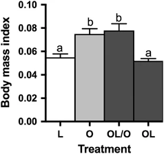
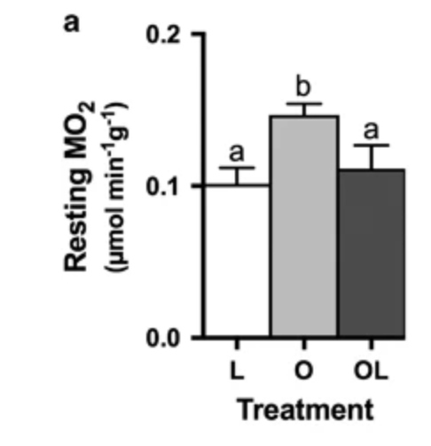
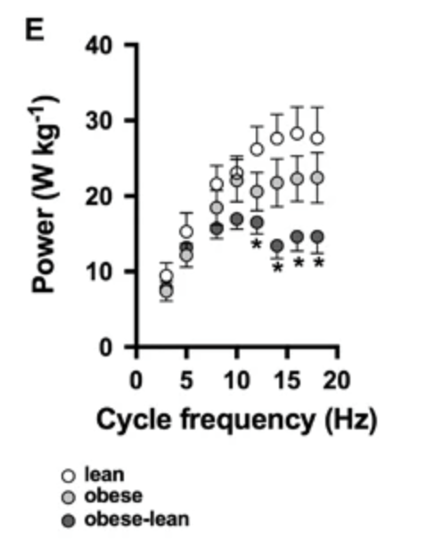

## Background

Obesity is known to alter skeletal muscle phenotypes, which can impair both loco motor performance and energy metabolism, potentially creating a physiological barrier to physical activity and further weight regulation. While weight loss is a commonly recommended intervention for reversing the adverse effects of obesity, it remains unclear whether obesity-induced changes in muscle contractile and metabolic properties are fully reversible. This study aimed to determine whether diet-induced obesity causes persistent alterations in muscle function, and whether these changes can be reversed through weight loss.

## Methods


Using adult zebrafish (*Danio rerio*) as a vertebrate model, the researchers employed a factorial design to evaluate the effects of obesity and subsequent weight loss on muscle function. Fish were categorized into three groups: (1) lean controls, (2) diet-induced obese (DIO) fish, and (3) weight-reduced (WR) fish that were previously obese but returned to a lean phenotype through dietary restriction. Across these groups, they assessed:

-    Whole-animal metabolic performance (resting and maximal metabolic rates)

-    Swimming capacity and loco motor endurance

-    Muscle contractile properties (isometric force, relaxation rates, work-loop power output)

-    Muscle myosin heavy chain (MHC) isoform composition

Citrate synthase activity as a proxy for mitochondrial content

## Data Availability

The data is available in their article [Obesity-induced decreases in muscle performance are not reversed by weight loss](https://www.nature.com/articles/ijo201781#Sec8) it is then linked to a dryad digital repository [Data from: Obesity-induced decreases in muscle performance are not reversed by weight loss](https://datadryad.org/dataset/doi:10.5061/dryad.5k303) in the form of an xlsx.

```{r}
#Load packages being used
library(dplyr)
library(ggplot2)
library(readxl)
library(lmPerm)
library(RVAideMemoire)
```

## Fig 1 Body Mass Index (Descriptive Statistics)



The Descriptive Statistics I am going to use is the Body Mass Index. This was a descriptive statistic that summarized the body size and conditions of each treatment group of fishes. L(lean), O(obese), OL(obese-lean),OL/O(obese-lean diet restriction), OL(obese fish that underwent weight loss). The results is as expected that we see the obese group has a larger body mass index value while the lean and obese/lean have lower body mass index values. These BMI values are calculated by

$BMI = \frac{\text{Mass (g)}}{\left(\text{Length (cm)}\right)^2}$

```{r}
#Here I am calling the data which is an excel on my computer. I ran a skip = 1 on the first column as the this column was just the name of the table and did not have any actual data to be used.
data <- read_excel("C:/Users/jzeng21/Desktop/AN588/Replication/IJO201781_Dryad+data.xlsx", skip = 1)

#running head() to see data
head(data)

#Here I am creating another data set called bmi_summary that is going to summarize the data. It will run mean() and use sd()/sqrt() to get the standard error of bmi. By utilizing pipe operation (|>) it allows me to take a row in data and then group it. I can then run mean() and sd() to the group and get the values I want.
bmi_summary <- data |>
  group_by(TRT) |>
  summarise(mean_bmi = mean(`Body mass index`, na.rm = TRUE),
    se_bmi = sd(`Body mass index`, na.rm = TRUE) / sqrt(n()))

# Adjusting bar position on the graph
bmi_summary$TRT <- factor(bmi_summary$TRT, levels = c("L", "O", "OLO", "OL"))

# Plot using ggplot the bmi_summary data frame that has the mean values and have standard error bars from se values in that data frame
ggplot(bmi_summary, aes(x = TRT, y = mean_bmi)) +
  geom_bar(stat = "identity", fill = "steelblue", width = 0.6) +
  geom_errorbar(aes(ymin = mean_bmi - se_bmi, ymax = mean_bmi + se_bmi), width = 0.2, color = "black") + labs(title = "Body Mass Index by Treatment Group", x = "Treatment Group", y = "BMI (mean ± SE)") + theme_minimal()

```

```{r}
#Here is what bmi_summary has
bmi_summary
```

## Fig 2A Resting Metabolic Rate Difference (Inferential Statistics)



```{r}
#The data is on the same excel but just on a different sheet. Here I call the data to data_mo2 and then read the specific sheet "MR" that had the metabolic rate information. Also skipping 1 since top row is not information needed
data_mo2 <- read_excel("C:/Users/jzeng21/Desktop/AN588/Replication/IJO201781_Dryad+data.xlsx", sheet = "MR", skip = 1)
head(data_mo2)
```

The inferential Statistics I am replicating is the Resting Metabolic Rate Difference. Here the authors wanted to compare resting metabolic rates between 3 groups.

The main method that the authors used was running a **permutation ANOVA** (nonparametric) on **Resting MO₂** using the library(lmPerm). Here I am trying to see if I can get a similar P value through the Anova that they did (P= 0.0068)

Result: I was able to get a P-value of 0.006325. Although this was not the same as the original article it is still very close. This small difference could be due to random re sampling in permutations depending on the amount of iterations, or perhaps rounding of values in the original analysis. Nonetheless still very close.

They also then performed a post-hoc test to find out which groups differed from each other. They specifically did pairwise permutation t-test for the comparisons. For each comparison I was able to replicate very similar values. The post hoc values will change everytime you run it unless you set a seed. The table I made was one of the runs

```{r}
#Here I am using lmp() from the library it stands for linear model permutation. Then by running Resting ~ TRT tilde operator I can set Resting as the dependent varaible and TRT as the independent variable.
perm_mo2 <- lmp(Resting ~ TRT, data = data_mo2)
summary(perm_mo2)
```

```{r}
# Summary stats for plotting, similar to the summary data of the BMI
mo2_summary <- data_mo2 |> 
  group_by(TRT) |>
  summarise(
    mean_resting = mean(Resting),
    se_resting = sd(Resting) / sqrt(n())
  )


mo2_summary$TRT <- factor(mo2_summary$TRT, levels = c("L", "O", "OL"))


ggplot(mo2_summary, aes(x = TRT, y = mean_resting)) +
  geom_bar(stat = "identity", fill = "gray70", width = 0.7) +
  geom_errorbar(aes(ymin = mean_resting - se_resting, ymax = mean_resting + se_resting), width = 0.2) + scale_x_discrete(expand = c(0, 0)) +labs( title = "Resting Metabolic Rate by Treatment", x = "Treatment Group",y = expression("Resting MO"[2]~"(μmol min"^{-1}~g^{-1}*")")) + theme_minimal()


```

```{r}
mo2_summary
```

```{r}
#Post-hoc test. To run the test I am using pairwise.perm.t.test from the library(RVAideMemoire). A good analogy for this is like making a punnet square for the different treatments.
pairwise.perm.t.test(data_mo2$Resting, data_mo2$TRT, p.method = "fdr")
```

| Comparison                        | P-value   | Significant? |
|-----------------------------------|-----------|--------------|
| **Lean vs Obese (L vs O)**        | **0.006** | Yes          |
| **Lean vs Obese-Lean (L vs OL)**  | 0.586     | No           |
| **Obese vs Obese-Lean (O vs OL)** | 0.048     | Yes          |

Comparing these values to the paper

-   **Lean and Obese are significantly different** (matches paper: P \< 0.001 reported; mine 0.006 after FDR is very close)

<!-- -->

-    **Lean and Obese-Lean are *not* different** (matches paper: P = 0.98 reported, mine 0.586 — close due to permutation randomization)

<!-- -->

-    **Obese and Obese-Lean are different** (matches paper: P = 0.04 reported, matchesmine 0.048)

## Fig 3E Cycle Frequency (Replication Figure)



For my figure replication, I chose to reproduce Figure 3E, which plots maximum muscle power output (W/kg) across different cycle frequencies (Hz) for three treatment groups: Lean (L), Obese (O), and Obese–Lean (OL). Unlike many other figures in the paper that use bar plots, this figure is a line graph with mean ± standard error bars, making it a more dynamic representation of how muscle function changes with stimulation frequency.

Cycle frequency refers to the rate at which muscle contractions were repeated during the work-loop experiments, measured in Hertz (Hz) — i.e., cycles per second. It represents the speed of muscular activity, simulating different levels of physical effort.

The figure shows how muscle power output increases with cycle frequency, peaks, and then often declines — a common feature of work-loop physiology. It also highlights that Lean fish produced more power at higher frequencies compared to Obese–Lean and Obese fish, reflecting reduced muscle performance with obesity that is not fully recovered after weight loss.

I replicated this figure by calculating mean power output ± standard error for each group at each cycle frequency and plotted them using `ggplot2`. I used different point shapes and fill colors (open/filled circles and triangles) to match the original visual style. This figure also demonstrates group × frequency interactions, which the original study analyzed using permutational models.

```{r}
# Load your data
data_power <- read_excel("C:/Users/jzeng21/Desktop/AN588/Replication/IJO201781_Dryad+data.xlsx", sheet = "cycle")

# Clean and summarize: mean + SE per group per frequency
power_summary <- data_power |>
  group_by(TRT, `cycle frequency (Hz)`) |>
  summarise(
    mean_power = mean(`Maximum PO (W/kg)`, na.rm = TRUE),
    se_power = sd(`Maximum PO (W/kg)`, na.rm = TRUE) / sqrt(n()),
    .groups = "drop"
  )

power_summary <- rename(power_summary, freq = `cycle frequency (Hz)`)

ggplot(power_summary, aes(x = freq, y = mean_power, group = TRT)) +
  geom_line(color = "black") +
  geom_point(
    aes(shape = TRT, fill = TRT),
    size = 2.5,
    color = "black",
    stroke = 0.7
  ) +
  geom_errorbar(aes(ymin = mean_power - se_power, ymax = mean_power + se_power),
                width = 0.3) +
  scale_shape_manual(values = c("L" = 21, "O" = 21, "OL" = 21)) +
  scale_fill_manual(values = c("L" = "white", "O" = "gray", "OL" = "black")) +
  labs(
    title = "Power Output Across Cycle Frequencies",
    x = "Cycle Frequency (Hz)",
    y = expression("Maximum PO (W/kg)")
  ) +
  theme_minimal()


```

So what does the graph show? Well we see that power output increased with cycle frequency in all groups but peaked and declined at high speeds. Obese–lean fish consistently produced less power at ≥12 Hz compared to lean fish, and also underperformed obese fish at 14 Hz and higher. These results indicate that muscle performance is impaired by obesity and not fully restored by weight loss.

## Discussion

In this replication, I reproduced one descriptive, one inferential, and one visual figure-based result from a study on the physiological effects of obesity in zebrafish. The descriptive statistic—Body Mass Index (BMI) was used to summarize the body condition across treatment groups, showing that obese fish had visibly higher BMI values than lean or obese–lean fish. The inferential analysis focused on resting metabolic rate (Figure 2a), where permutation ANOVA confirmed significant differences between treatment groups, replicating the original finding that obese fish had higher resting MO₂ than lean or obese–lean fish. Post-hoc tests showed that lean and obese–lean fish did not differ significantly, suggesting a partial recovery of metabolic efficiency following weight loss. Lastly, I replicated Figure 3E, which showed maximum power output across increasing cycle frequencies. This non-bar graph figure revealed that obese–lean fish had lower power output at higher cycle frequencies compared to both lean and obese fish, indicating that muscle performance impairments caused by obesity may persist even after weight reduction. All three replications aligned closely with the published results, supporting the robustness of the original study’s findings.

## Conclusion

This replication successfully confirmed key physiological effects of obesity and weight loss in zebrafish using both descriptive and inferential statistics, as well as a non-bar graphical analysis. The use of permutation-based methods in the original study allowed robust testing without strict distributional assumptions, which was especially appropriate given the small sample sizes. The consistency of results across BMI, metabolic rate, and muscle function strengthens the original paper’s conclusion that while some physiological traits recover after weight loss, others—particularly muscle performance—may remain impaired. This highlights the importance of multi-system evaluation when assessing the biological impacts of obesity and recovery.
